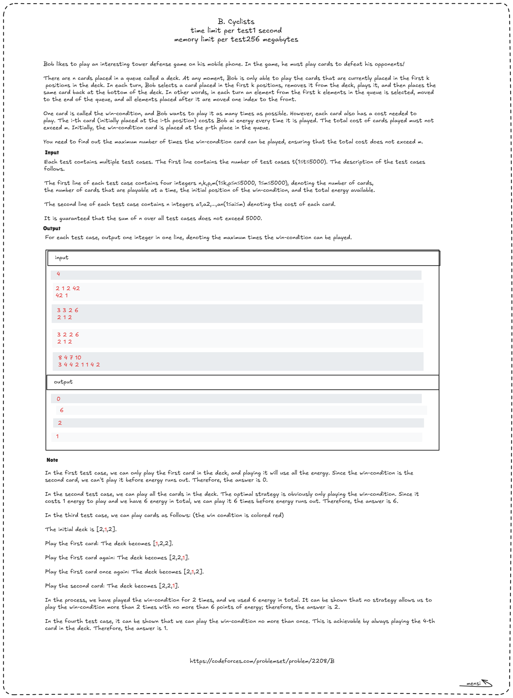
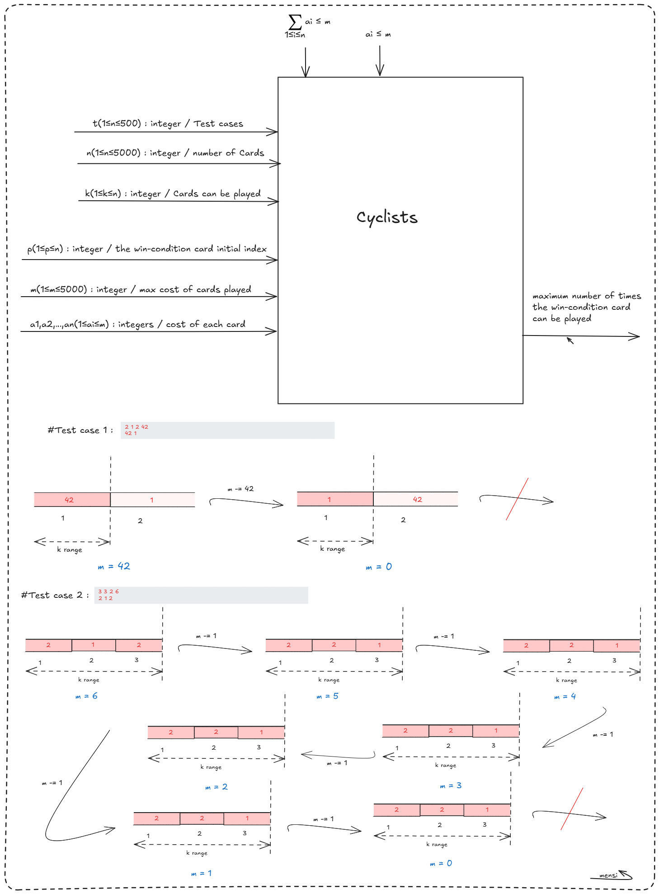

# **Cyclists – Codeforces Round 1086 (Div. 2) Writeup**



### Problem Summary

Bob is playing a mobile card game with **n cards** arranged in a queue (deck). He can only pick cards from the **first k positions** of the deck at any moment. Each card costs energy to play, and one special card (the **win-condition**) is at position **p**. After playing a card, it goes to the **end of the deck**.

Bob wants to **play the win-condition card as many times as possible** without exceeding a total energy limit of **m**.

We are given multiple test cases. For each, we must determine the **maximum times the win-condition card can be played**.

**Constraints**:

- $1 \le t \le 5000$ test cases
- $1 \le k, p \le n \le 5000$, $1 \le m \le 5000$
- $1 \le a_i \le m$ (cost of each card)
- Sum of n over all test cases ≤ 5000

**Output**: For each test case, print **one integer**, the maximum times the win-condition card can be played.

---

### Observations

1. The naive idea of always picking the win-condition card may fail if it is **not in the first k cards**.
2. If the win-condition is beyond the first k, we need to **remove cheaper cards in front of it** to bring it within reach.
3. If multiple cards have the same cost as the win-condition, we must **track the exact index of the win-condition card**, not just its value, because card costs can repeat.

**Key insight**: simulate the game while **tracking the win-condition by its position**. Whenever a card is removed before it, the index shifts left; if the card is played, it moves to the end.

---

### Step-by-Step Solution



1. Read **t** test cases.
2. For each test case:

   - Track the **win-condition index** (`win_pos = p-1`).
   - While we have energy (`money >= 0`):

     1. If the win-condition is in the first k cards:

        - Pay its cost, increment the counter, move it to the end (`win_pos = n-1`).

     2. Otherwise:

        - Pick the **cheapest card among the first k**, pay its cost, move it to the end.
        - **Adjust win_pos** if a card before it was removed.

3. Print the total times the win-condition card was played.

---

### Example Walkthrough

**Input**:

```
4
2 1 2 42
42 1
3 3 2 6
2 1 2
3 2 2 6
2 1 2
8 4 7 10
3 4 4 2 1 1 4 2
```

**Output**:

```
0
6
2
1
```

- **Test case 1**: Only the first card can be played. Win-condition is second → can't play → 0.
- **Test case 2**: Win-condition is already in first 3; energy allows 6 plays → 6.
- **Test case 3**: Must remove first card once, then win-condition is playable → 2.
- **Test case 4**: Only one energy-efficient path → play win-condition once → 1.

---

### Code Implementation (Python)

```python
t = int(input())
for _ in range(t):
    n, k, p, m = map(int, input().split())
    deck = list(map(int, input().split()))

    win_pos = p - 1      # track the winning card by index
    money = m
    count = 0

    while True:
        if win_pos < k:
            cost = deck[win_pos]
            if money < cost:
                break
            money -= cost
            count += 1
            deck.pop(win_pos)
            deck.append(cost)
            win_pos = n - 1
        else:
            pickable = deck[:k]
            min_cost = min(pickable)
            if money < min_cost:
                break
            idx = pickable.index(min_cost)
            money -= min_cost
            deck.pop(idx)
            deck.append(min_cost)
            if idx < win_pos:
                win_pos -= 1

    print(count)
```

---

### Explanation

- Track the win-condition **by index**, not value.
- Adjust `win_pos` whenever a card **before it is removed**.
- Pick **cheapest card** if the win-condition is not within first k.
- Count how many times the win-condition card is played before energy runs out.

---

### Complexity Analysis

- **Time complexity**: $O(t \cdot n \cdot k)$ in worst case, since we check the first k cards repeatedly.
- **Space complexity**: $O(n)$ per test case.

Given constraints, this simulation is efficient enough.

---

### Takeaways

- When items have **duplicate values**, always **track them by position** to avoid ambiguity.
- Greedy simulations often require careful index adjustments.
- A small, correct simulation beats a complex formula in tricky games like this.
