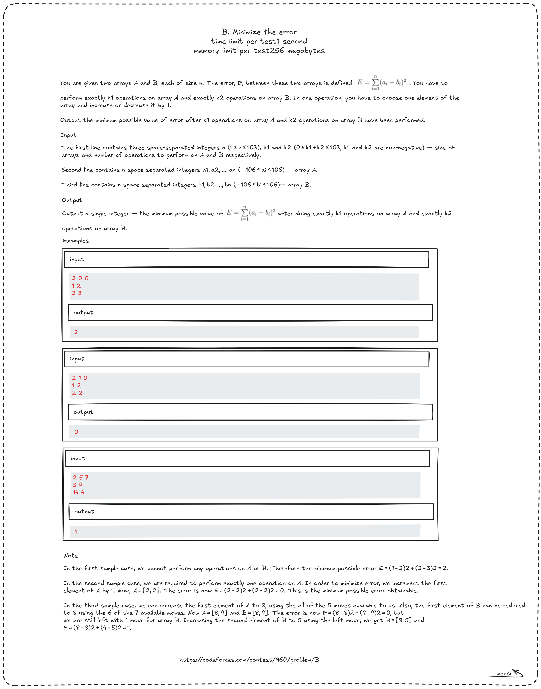

---

# **Minimize the Error – Codeforces Round 474 (Div. 2)**



## **Problem Summary**

We are given two arrays:

- $A$ of size $n$
- $B$ of size $n$

The error between them is:

$$
E = \sum_{i=1}^{n} (A_i - B_i)^2
$$

We must perform:

- exactly $k_1$ operations on array $A$
- exactly $k_2$ operations on array $B$

In one operation, we can choose an element and either:

- increase it by $1$
- decrease it by $1$

We must output the **minimum possible value** of $E$ after exactly $(k_1 + k_2)$ operations.

---

## **Key Observation**

The error depends only on the differences:

$$
d_i = |A_i - B_i|
$$

Because:

$$
(A_i - B_i)^2 = d_i^2
$$

So the problem becomes:

> We have an array of differences $d_1, d_2, ..., d_n$
> We must perform exactly $k = k_1 + k_2$ operations.
> In one operation we can modify one $d_i$ by **1**.

---

## **How Does One Operation Affect $d_i$?**

If we change $A_i$ or $B_i$ by $1$, the difference changes by:

- either **decrease by 1**
- or **increase by 1**

But to minimize the error, we always want to reduce the biggest difference.

So the best move is always:

- pick the maximum $d_i$
- reduce it by 1 (if possible)

---

## **Special Case: When the Maximum Difference is 0**

If all differences become zero but we still have remaining operations, then:

- any operation will make a $0$ become $1$

So:

- if $d_i = 0$, then after one operation it becomes $1$

That is why the greedy rule is:

- if $x > 0$ → do $x = x - 1$
- else → do $x = x + 1$

---

## **Greedy Strategy**

At every step:

1. choose the largest difference
2. reduce it by 1 (or increase if it's already 0)
3. put it back

This greedy is correct because:

- the function $x^2$ grows very fast
- reducing a large value decreases the total sum much more than reducing a small one

Example:

- decreasing $10^2$ to $9^2$ reduces error by **19**
- decreasing $2^2$ to $1^2$ reduces error by **3**

So we always want to reduce the biggest value first.

---

## **Why Use a Max Heap?**

We need to repeatedly get the maximum difference quickly.

A max heap supports:

- extract maximum: $O(\log n)$
- insert: $O(\log n)$

So total complexity:

$$
O(k \log n)
$$

Where:

$$
k = k_1 + k_2 \le 1000
$$

So this is very fast.

---

## **Algorithm**

For each test case:

1. Read $n, k_1, k_2$
2. Read arrays $A$ and $B$
3. Compute differences:

$$
d_i = |A_i - B_i|
$$

4. Insert all $d_i$ into a max heap
5. Repeat $k = k_1 + k_2$ times:

   - extract maximum $x$
   - if $x > 0$ decrease it
   - else increase it
   - insert it back

6. Compute final answer:

$$
E = \sum d_i^2
$$

---

## **Complexity Analysis**

- Building heap: $O(n)$
- Each operation: extract + insert = $O(\log n)$
- Total operations: $k$

So:

$$
\text{Time} = O(n + k\log n)
$$

With constraints:

- $n \le 1000$
- $k \le 1000$

This runs easily within limits.

Memory:

$$
O(n)
$$

---

## **Final C Code (Heap Solution)**

```c
#include <stdio.h>
#include <stdlib.h>


struct Heap {
    int* arr;
    int size;
    int capacity;
};
typedef struct Heap heap;

typedef struct {
    int a;
    int b;
    int diff;
} Pair;

heap* createHeap(int capacity, int* nums);
void insertHelper(heap* h, int index);
void maxHeapify(heap* h, int index);
int extractMax(heap* h);
void insert(heap* h, int data);
void printHeap(heap* h);

int cmp(const void *x, const void *y);

int main()
{
    int n, k1, k2;
    scanf("%d %d %d", &n, &k1, &k2);

    int A[n], B[n], C[n];

    for (int i = 0; i < n; i++)
        scanf("%d", &A[i]);

    for (int i = 0; i < n; i++)
        scanf("%d", &B[i]);

    Pair arr[n];

    for (int i = 0; i < n; i++) {
        arr[i].a = A[i];
        arr[i].b = B[i];
        arr[i].diff = abs(A[i] - B[i]);
    }

    qsort(arr, n, sizeof(Pair), cmp);

    for (int i = 0; i < n; i++) {
        A[i] = arr[i].a;
        B[i] = arr[i].b;
    }

    for (int i = 0; i < n; i++) {
        C[i] = arr[i].diff;
    }

    heap* h = createHeap(n, C);

    int k = k1 + k2;

    for (int i = 0; i < k; i++) {
        int x = extractMax(h);
        if (x > 0) x--;
        else x++;

        insert(h, x);
    }


    long long E = 0;

    for (int i = 0; i < h->size; i++) {
        long long x = h->arr[i];
        E += x * x;
    }

    printf("%lld\n", E);

    return 0;

}

heap* createHeap(int capacity, int* nums)
{
    heap* h = (heap*)malloc(sizeof(heap));
    if (h == NULL) {
        printf("Memory error\n");
        return NULL;
    }

    h->size = capacity;
    h->capacity = capacity;

    h->arr = (int*)malloc(capacity * sizeof(int));
    if (h->arr == NULL) {
        printf("Memory error\n");
        free(h);
        return NULL;
    }

    for (int i = 0; i < capacity; i++)
        h->arr[i] = nums[i];

    // Build heap
    for (int i = (h->size - 2) / 2; i >= 0; i--)
        maxHeapify(h, i);

    return h;
}

void insertHelper(heap* h, int index)
{
    if (index == 0)
        return;

    int parent = (index - 1) / 2;

    if (h->arr[parent] < h->arr[index]) {
        int temp = h->arr[parent];
        h->arr[parent] = h->arr[index];
        h->arr[index] = temp;

        insertHelper(h, parent);
    }
}

void maxHeapify(heap* h, int index)
{
    int left = index * 2 + 1;
    int right = index * 2 + 2;
    int max = index;

    if (left < h->size && h->arr[left] > h->arr[max])
        max = left;

    if (right < h->size && h->arr[right] > h->arr[max])
        max = right;

    if (max != index) {
        int temp = h->arr[max];
        h->arr[max] = h->arr[index];
        h->arr[index] = temp;

        maxHeapify(h, max);
    }
}

int extractMax(heap* h)
{
    if (h->size == 0) {
        printf("Heap is empty.\n");
        return -999;
    }

    int deleteItem = h->arr[0];
    h->arr[0] = h->arr[h->size - 1];
    h->size--;

    maxHeapify(h, 0);
    return deleteItem;
}

void insert(heap* h, int data)
{
    if (h->size >= h->capacity) {
        printf("Heap is full.\n");
        return;
    }

    h->arr[h->size] = data;
    h->size++;

    insertHelper(h, h->size - 1);
}

void printHeap(heap* h)
{
    for (int i = 0; i < h->size; i++)
        printf("%d ", h->arr[i]);
    printf("\n");
}
int cmp(const void *x, const void *y)
{
    Pair *p1 = (Pair *)x;
    Pair *p2 = (Pair *)y;
    return p1->diff - p2->diff;
}
```

---

## **Takeaways**

- The problem only depends on the differences $|A_i - B_i|$.
- Minimizing the sum of squares requires always reducing the maximum difference.
- A max heap is perfect to repeatedly extract the current maximum efficiently.
- If all values become $0$ but operations remain, the answer increases (because we must still perform operations).

This greedy + heap approach is the standard optimal solution for this problem.
