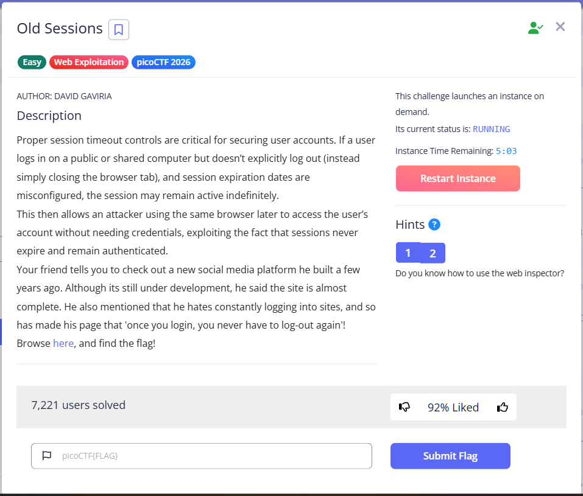
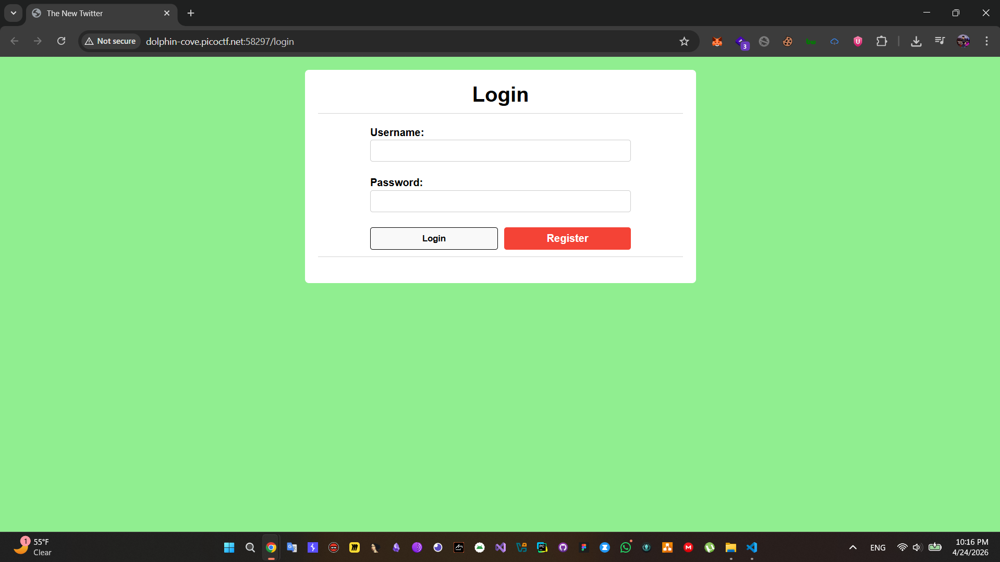
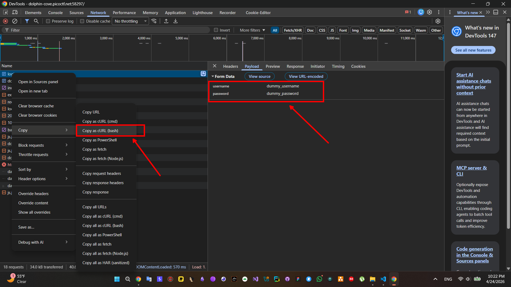
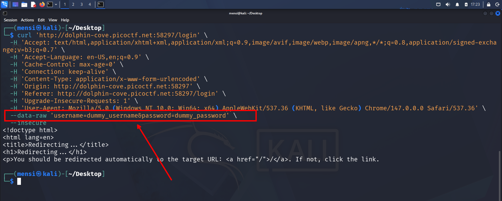
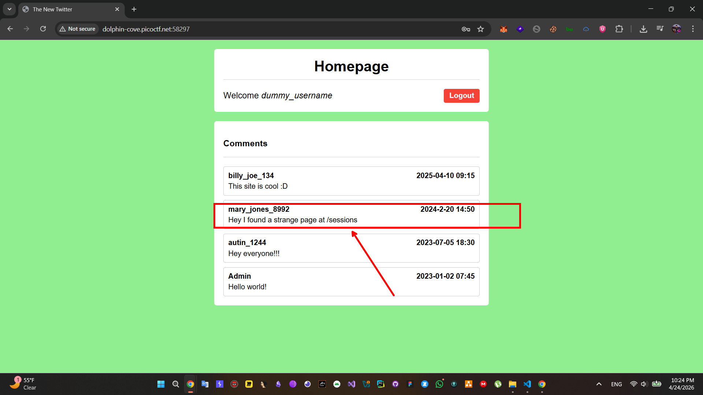
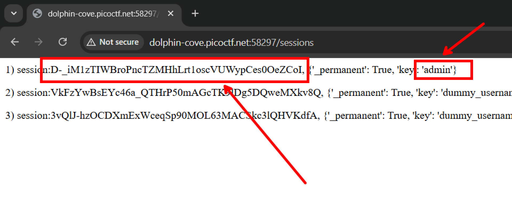
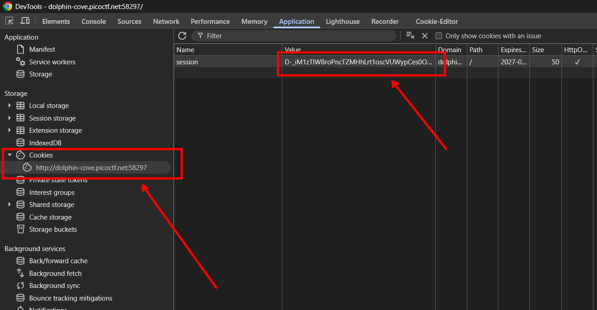
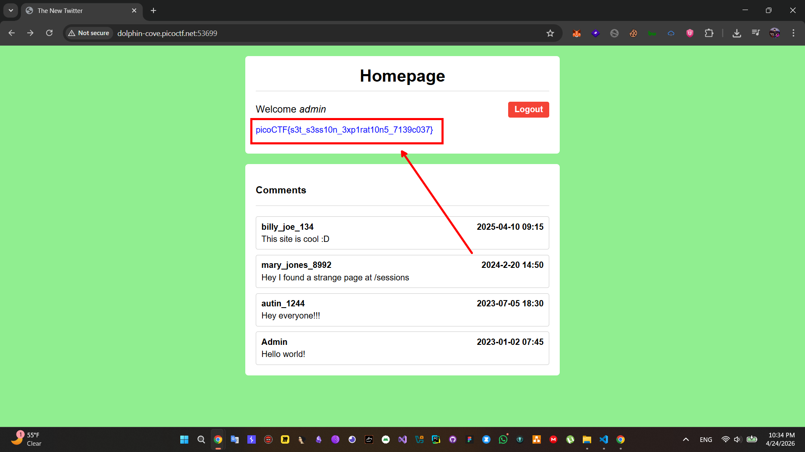
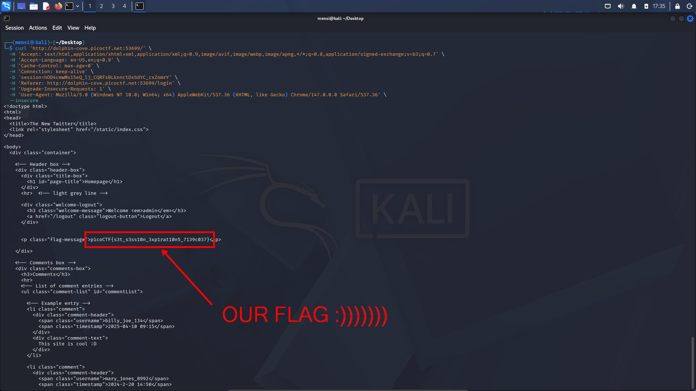

# **Old Sessions - picoCTF (picoGym) Writeup**

## **Description**



## **Solution**


In this challenge we are given a login & register page.



The description of the challenge mentions an old session, so the first thing i did is register and login using dummy creds.





After a successful login i found a user `mary_jones_8992` with a description says `Hey I found a strange page at /sessions` which clearly mentions a `/sessions` route.



Visiting the `/sessions` route i found the `admin` sessions ID.




i changed my session ID with the admin session ID in the browser `Cookies` in `Application` panel.



Refreshing the page i got the flag :))))))))





## **Flag**

```
picoCTF{s3t_s3ss10n_3xp1rat10n5_7139c037}
```


